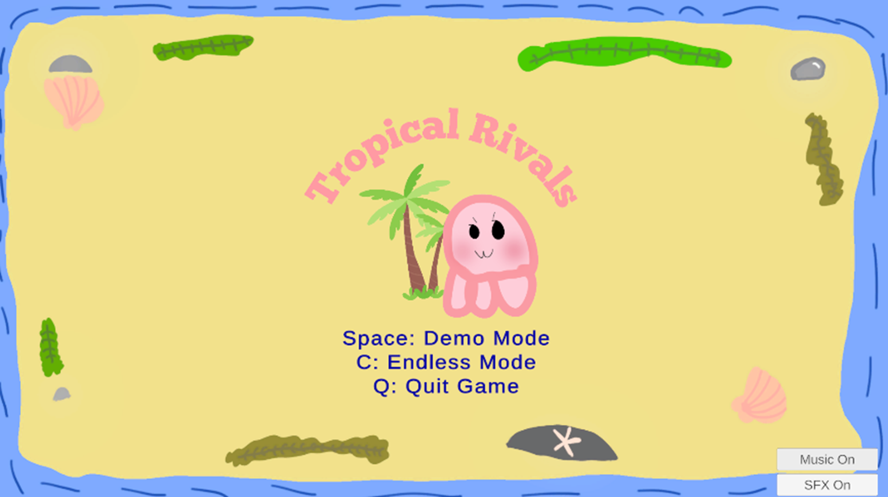
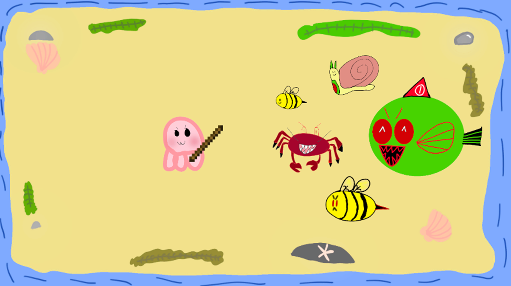

# **Tropical Rivals**

# Introduction

Tropical Rivals is a 2D roguelike game where players control an Octo and survive against waves of enemies in an oceanic region. The game includes a standard wave mode and an Endless Mode, where enemy stats gradually increase as the player clears more waves. This project focuses on creating a simple, replayable, and competitive gameplay experience that can be enjoyed casually or challenged at higher difficulty levels.

## Gameplay Features

- Play as Octo and survive waves of enemies.
- Fight enemies such as Smol Bee, Sneaky Crab, Sea Snail, Possessed Pufferfish, and Angy Bee.
- Use Octo’s stick weapon to damage nearby enemies.
- Enemies spawn randomly around the island and deal contact damage when they touch Octo.
- Defeating enemies heals Octo based on the enemy type.
- Demo Mode includes 5 waves and ends with a victory screen.
- Endless Mode continues after Demo Mode, with enemies gaining small HP, ATK, and SPD increases each wave.
- When Octo reaches zero HP, the game ends and shows the final Endless wave score.

## Controls

| Action | Control |
|---|---|
| Move | WASD |
| Attack | Left Click |
| Start Demo Mode | Space |
| Start Endless Mode | C |
| Pause | ESC |
| Restart | R |
| Return to Main Menu / Exit | E |
| Quit Game | Q |

## Screenshots

## Poster

[View Capstone Poster](Tropical%20Rivals%20Capstone%20Poster.pdf)

## Tools Used

- **Unity**
- **Microsoft Visual Studio for C#**
- **Sketchbook App**
- **GitHub**
- **GitHub Pages / Jekyll**

## Developer

**Chris Hernandez** 
Computer Science Capstone @ CSU Channel Islands 
Made with love and passion~
